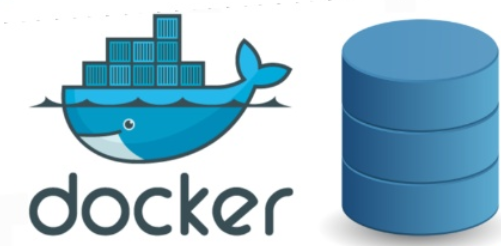

## Why do we need Docker Volumes

A container runs on host machine. It has a virtual filesystem and say it contains a database. But
there is no data preservation. Once I stop or restart the container, the data is gone!

That's where docker volumes comes into picture. It is used to persist the data in the container.

## What is Docker Volumes
It connects the physical filesystem(host filesystem) path to the virtual filesystem path.

So, a folder of physical filesytem is mounted on the virtual filesystem of the Docker.
## Docker Volumes Types
# 1.Host Volumes:

A host volume can be accessed from within a Docker container and 
is stored on the host, as per the name. 
To create a host volume, run:

docker run -v /path/on/host : /path/in/container

Use host volume when you need to know where to refer to the data. It’s also the easiest type of volume 
to use, so it’s ideal for simple projects.

# 2.Anonymous Volumes:
To run anonymous volume, run:

docker run -v /path/in/container

While creating the volume user doesn't specify which folder in the host filesystem is
to be mounted on the container filesystem.Docker takes care of the folder.

They provide flexibility, but it can be difficult 
to refer to the same volume when it is anonymous.

# 3.Named Volumes:
To create a named volume, run:

docker volume create somevolumename

docker run -v name : /path/in/container 

Named volumes and 
anonymous volumes are similar in that Docker manages where they are located.
Like anonymous volumes, named volumes provide flexibility, 
but they are also explicit. This makes them easier to manage.

## Tips

 If you need to use a volume, consider the difference between the various kinds before starting development. 
 This will make it easier 
 to save data from the start and specify your volume in your Dockerfile.